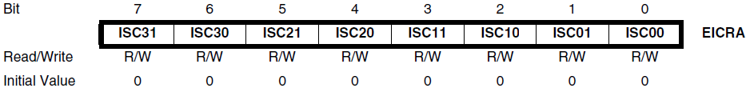
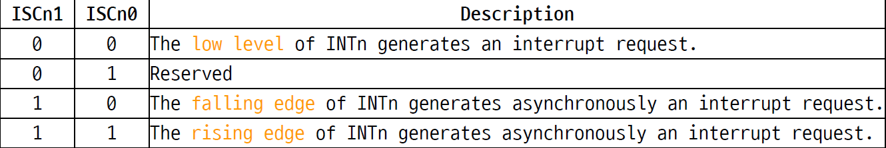
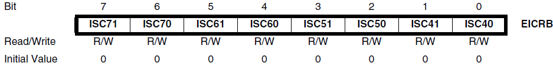
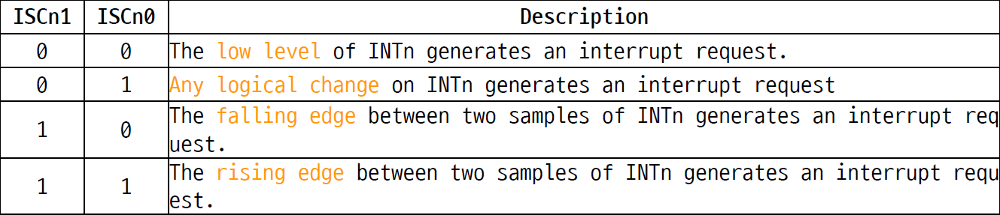
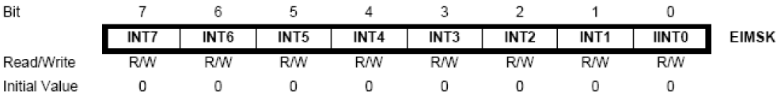
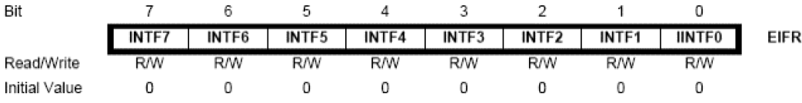
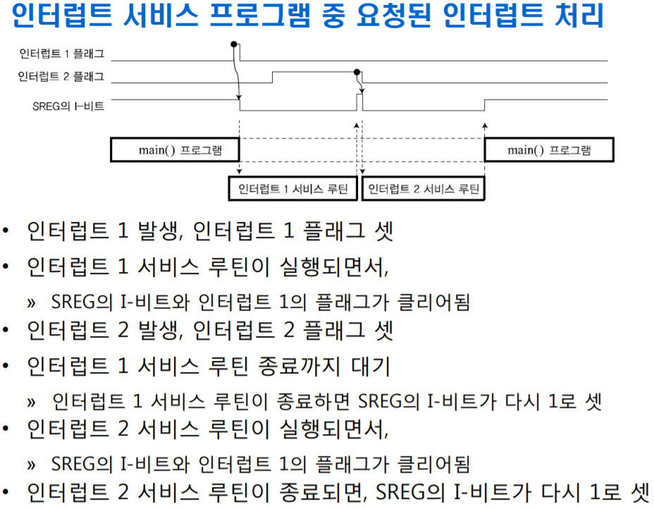

## Interrupt 인터럽트
---

#### 종류
- 원인: 하드웨어 인터럽트 / 소프트웨어 인터럽트
- 확인방법: 폴링(polling) / 벡터(vector)

#### 하드웨어 인터럽트
- 외부 인터럽트: 전원 입출력 장치, 주변 장치등의 외부장치에 의해 발생하는 인터럽트   
- 내부 인터럽트

#### ISR (인터럽트 서비스 루틴)
 
- CPU는 여러종류의 인터럽트를 처리가능한데 각 인터럽트에 고유한 번호가 부여된다. >> '인터럽트 벡터(vector)'
- 어셈블리 프로그램 관점: 인터럽트 발생 - 인터럽트 벡터 테이블(메모리에 위치)로 분기 - 각각의 인터럽트에 대한 ISR로 점프 하는 어셈블리 명령어가 테이블에 위치
---
### ATmega 128의 인터럽트

### [인터럽트 벡터 ]
- 각 인터럽트 벡터에 대해 설정된 분기 주소가 모여 있는 메모리블록이 존재 >> '인터럽트 벡터 테이블'
- 위에서 언급한 주소는 프로그램메모리 영역 주소; 테이블에는 각 인터럽트 벡터에 대해 2워드(16Bits)만큼 할당
- 2워드 명령어 "JMP xxxx"를 써 놓게 되는데 여기서 xxxx는 ISR의 주소에 해당
- 인터럽트 벡터 및 우선순위 
---
### [인터럽트 허용/금지]

- 특정 인터럽트의 허용: 특정 인터럽트에대한 개별인터럽트 마스크와 상태레지스터의 SREG.I가 모두 set되어 있어야 한다.
- 개별인터럽트 마스크: 각 인터럽트에 대해 인터럽트 마스크 비트가 존재(뒤에서 다룸)
- SREG.I: Status Register의 I라는 MSB; set: 인터럽트 허용, reset: 모든 인터럽트 일괄 금지
- "avr/interrupt.h"에 인터럽트 허용/금지를 결정하는 함수 존재
    ```
    sei() // 인터럽트 허용; SREG.I를 set시키는 역할
    cli() // 인터럽트 금지; SREG.I를 reset시키는 역할
    ```
---
### [외부인터럽트와 관련된 레지스터들]
##### 1. 외부 인터럽트 제어레지스터A,B(External interrupt control registerA,B)
   - 외부에서 들어온 인터럽트를 어떻게 감지할 것인가에 대한 레지스터
   - ##### EICRA: INT0~3까지에 대한 감지 방법을 제어  
     - asynchronously: 비동기적으로 인터럽트 요구 
   - ##### EICRB: INT4~7까지에 대한 감지 방법을 제어  
     - falling(하강모서리), rising(상승모서리)에서 인터럽트요구를 감지 
---
##### 2. 외부 인터럽트 마스크레지스터(External interrupt mask register) 
- 'EIMSK'
- n번째 bit가 set된 상태에서 SREG.I가 1인 상태(전역으로 인터럽트 허용된 상태)일때 외부 인터럽트 INTn이 허용된다.
- reset시에는 해당 INTn 금지

##### 3. 외부 인터럽트 플래그레지스터(External interrupt flag register) 
- 'EIFR' 
- 특정 INTn의 인터럽트 요구 전에는 해당 비트가 0으로 reset상태
- 인터럽트 요구시 해당 플래그 비트가 1로 set
- 해당 플래그 비트가 1로 set상태에서 해당 EIMSK 비트가 set & SREG.I 역시 1로 set상태라면 >> '인터럽트 벡터로 분기'
- ###### 해당 플래그비트는 ISR(인터럽트 서비스루틴) 수행 시작과 함께 다시 0으로 reset; The flag is cleared when the interrupt service routine executed.
- 프로그램상에서 논리 1을 인가시 플래그비트를 0으로 reset가능; The flag can be cleared by writing a logical '1' to it

---
#### 인터럽트 처리과정 
#####<인터럽트 처리과정>
######1. 인터럽트 요청 신호 검출
- 프로그램을 수행하는 도중에 인터럽트 요청이 발생할 경우 해당 장치의 인터럽트 플래그가 세트
  
######2. 인터럽트 요청 허용 여부 판단
- CPU는 해당 장치의 인터럽트 마스크 레지스터의 비트와 SREG의 전역 인터럽트 비트를 보고 허용 여부를 결정 
- 동시에 발생한 인터럽트 (두 개이상) 에 대해서 우선 순위를 결정

######3. 인터럽트 벡터 주소로 점프
- AVR은 인터럽트 벡터 주소가 하드웨어적으로 정해져 있어서 그 해당 주소로 점프

######4. ​복귀 정보 저장
- CPU는 현재의 동작 중인 프로그램의 위치인 프로그램 카운터 (PC) 값을 메모리 스택(Stack) 에 저장. 
- 인터럽트 수행 중에 다른 인터럽트의 허용을 막기 위해서 '일시적으로' 인터럽트 금지 상태로 설정.

######5.인터럽트 서비스 루틴의 수행
- CPU가 인터럽트 서비스 루틴으로 점프하여 해당 프로그램을 수행. 
- 인터럽트 서비스 루틴이 수행되면 해당 인터럽트 플래그비트는 자동으로 클리어. 
- 만일 인터럽트 서비스 루틴 수행 중에 다른 인터럽트를 허용하고자 한다면 여기서 '일시적으로' 금지된 인터럽트 상태를 바꿔 주어야 됨.

######6. 주 프로그램으로 복귀
- 인터럽트 수행이 종료되어 RETI 명령어를 만나게 되면 스택에서 프로그램 카운터 값을 찾아와 다시 원래 수행하던 주 프로그램으로 복귀.
- 앞서 '일시적으로' 금지된 인터럽트 상태도 해제.

---


---
#### Example 1
```C
// 인터럽트 예제 1
#include<avr/io.h>
#include<avr/interrupt.h>

void init_port(void) //초기화 
{
	DDRF = 0xF0;
	PORTF = 0x00; 
	DDRE = 0x00;
	PORTE = 0xFF;
}
void init_interrupt(void)
{
	EIMSK = 0x00; // EICRA와 EICRB를 설정하기 전 다른 인터럽트를 받지 않도록 
                        초기화 처리(사전작업) 
	EICRA = 0x00; 
	EICRB = 0x08; // INT5 신호의 두 샘플 사이의 하강 모서리(falling)가 
                        인터럽트요구 ; ISC51 = 1, ISC50 = 0 ;
	EIMSK = 0x20; // INT5라는 외부인터럽트허용 
	EIFR = 0xFF; // EIFR의 모든 비트에 논리 1을 인가>>플래그 전체 클리어 처리? 
}

int main(void)
{
	init_port();
	init_interrupt();
	sei();	// 인터럽트 허용 
	while(1); //인터럽트가 들어오길 기다리는 중
	return 0;
}

ISR(INT5_vect)
{
	PORTF = ~PORTF;
}
```
* INT5에 대해 falling에서 인터럽트를 요구받도록 설정하는 이유;
    Schematic을 참조하면 외부스위치와 pull-up저항으로 회로구성이 되어있으므로 스위치가 눌렸을때 인터럽트를 요구하기 위해서는 하강모서리에서 감지하도록 설정해줘야 한다.


