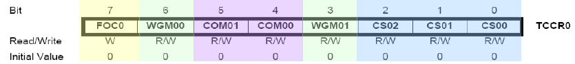
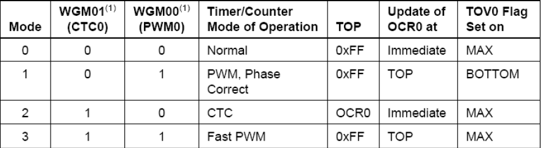
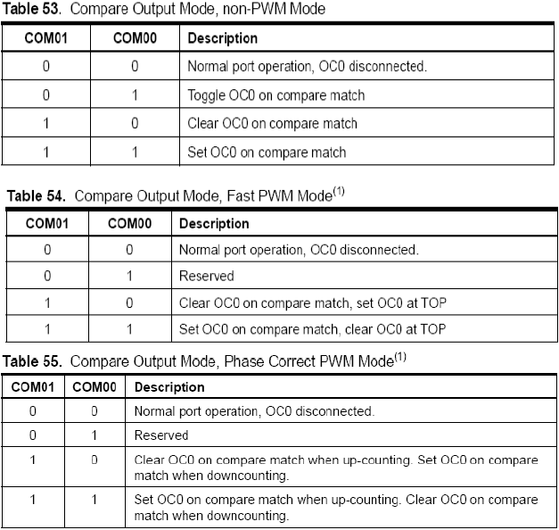
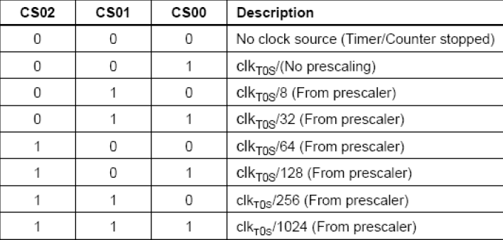
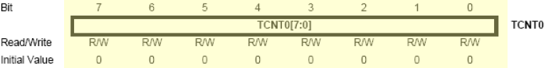
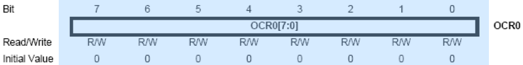
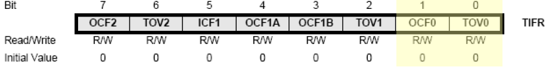
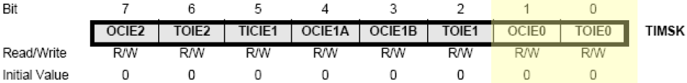
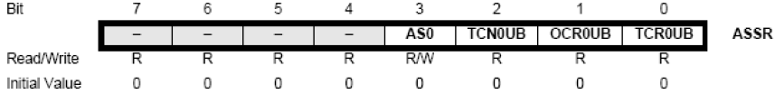

#### '주기적 타이머'의 필요성
- 컴퓨터, 임베디드 시스템에서 주기적으로 반복되는 동작을 수행하기 위해 필요로 되어지는  디지털 하드웨어 회로에 의한 신호를 만들기 위해 사용되는 방법
- 소프트웨어적인 기계어 실행없이 일정한 시간을 만들기 때문에 중앙처리장치(CPU)의 부담을 덜어준다
- '클럭'과 '디지털 회로'를 이용하므로 정확한 시간을 얻을 수 있다
- 실시간 시계와 달리 CPU의 클럭 주파수를 활용하는데 주파수가 높기 때문에 '프리스케일러'회로를 통해 주파수를 낮춘 다음 타이머 모듈에 공급해준다
- 카운터회로에 의해 일정시간이 되면 '인터럽트 디지털 신호'를 발생 > CPU가 접수 후 현재 실행중이던 기계어 코드를 종료 후 해당 ISR을 호출
---
#### ATmega128의 타이머/카운터
- `마이트로 컨트롤러에서 타이머/카운터는 입력되는 펄스를 세는 장치;` 즉 카운터의 역할을 한다.
- 이때 주기가 일정한 펄스의 경우 입력된 펄스의 개수를 통해 시간을 측정할 수도 있으므로 타이머 역할도 한다.
  - 내부 클록의 주기가 일정하므로 보통 타이머로 활용하기 위해서는 내부 클록을 이용한다.
- 2개의 8비트 타이머/카운터: Timer/Counter0, 2
- 2개의 16비트 타이머/카운터: Timer/Counter1, 3
- 각각의 타이머/카운터는 독립적인 prescaler(프리스케일러)를 가지고 작동

##### Prescaler( 프리 스케일러)
- 분주비 >> `주기를 일정한 비로 나눠주자`
- clkTOS/a >> a번의 clk신호를 1회의 clkTn으로 인식하겠다; (기준: Block Diagram)
  - `Ex) clkTOS/64 >> 64회의 clk신호입력을 1회의 clkTn으로 인식하고 TCNTn의 값을 카운팅하겠다.` 
##### PWM (Pulse Width Modulation) 신호
- PWM 신호는 비대칭형/대칭형으로 구현 가능
- Tpwm은 일정한 값을 가지며 '반송주기'(Carrier Period)라 한다
- `Ton`: 펄스가 ON에 머무르는 시간
- `Duty Ratio(듀티비)`: 전체 주기 Tpwm 중 ON에 머무르는 시간;
    - Duty Ratio = (Ton / Tpwm) * 100%
- Example: 듀티비100%인 신호>> DC신호, 듀티비30%인 신호>> 시간당 가해진 신호의 평균값은 DC신호의 30%
- PWM신호의 장점: ON-OFF 신호만으로 신호의 크기 조절 가능(D/A컨버터가 필요X)
---
##### 8비트 타이머/카운터0과 타이머/카운터2
- Timer/Counter0과 Timer/Counter2는 프리스케일러 값과 외부 클러을 사용하는 방법에 차이가 있을 뿐 동일한 동작을 한다.

| 용어 | 의미 |
|---|:---:|
|BOTTOM|카운터값이 0이 될 때 BOTTOM에 도달했다고 한다|
|MAX|8비트 타이머/카운터에 대해 카운터값이 0xFF(255)가 되면 MAX값에 도달했다고 한다|
|TOP|카운터값이 최대값이 되었을 때 카운터가 TOP에 도달했다 한다; `최대값은 0xFF이거나 비교레지스터 OCRn(n=0,2)로 설정가능`|

#### <관련 레지스터>
1. Timer/Counter Control Register `TCCRn(n=0,2)`

    - Bit6,3: `WGMn1:0`; `Wave Generaion Mode` 어떤 파형을 만들지를 결정;
      -   비 PWM모드: Normal, CTC
      -   PWN모드: Phase Correct, Fast PWM

    - Bit 5,4: `COMn1:0`; `Compare Match Output Mode` 출력 핀 OCn의 동작을 제어; 
      - OCn 핀을 사용하기 위해서는  공유 범용I/O핀의 방향을 출력으로 설정해야 함

---

- `Normal port operation, OC0 disconnected`: 범용I/O로 동작
- `~~~ on compare match`: 비교일치가 될 때 ~와 같이 동작
- `up-counting`: 카운터 증가 모드, `downcounting`: 카운터 감소 모드
---
##### TCCRn(n=0,2) [cont.]
- Bit2,1,0: `CSn2:0`; `Clock Selct` 세 비트를 통해 타이머/카운터n이 사용할 Prescaler값을 결정>>타이머/카운터n이 사용할 클록을 결정
- 아래 표는 `타이머/카운터0` 에 해당

    - `clkTOS`: 프리스케일러 입력 클록 `ASSR레지스터의 AS0이 0일 때 '내부 클록'(Block Diagram 상에서 clkI/O에 해당)`, 1일 때 TOSC1/TOSC2 핀의 수정발진자 주파수 이용
- Bit7: `FOCn`; `Force Output Compare`; 비PWM모드로 선택시 활성화
  -  1을 쓰면 파형생성유닛(Waveform Generation Unit)에 즉각적인 비교일치(Compare Match)를 전달; FOCn비트의 set가 인터럽트를 발생시키지 않음
---
2. Timer/Counter Register `TCNTn(n=0,2)` 타이머/카운터 레지스터
   
   - Block Diagram상에서 `Control Logic으로 입력되는 clkTn에 의해` 입력된 초기값으로부터 1씩 counting 된다.
   - Normal 모드의 경우>> 항상 증가를 하는 up-counting을 하며 8비트의 최대값(0xFF,255)에 도달하면 다시 BOTTOM(0x00)부터 카운트를 시작한다. 이때 `Overflow`(오버플로우)가 발생하며, 이를 인터럽트 신호로 보내준다.
     - TCNTn이 MAX에서 BOTTOM, 즉 0xFF에서 0x00이 되는 시점에서 오버플로 플래그 비트 TOVn이 1(set)이된다. 
     - Ex)  0부터 카운트시작시 256번의 clkTn가 입력될 때 TOVn >> Set !
3. Output Compare Register `OCRn(n=0,2)` 출력비교 레지스터
    
    - OCRn은 타이머/카운터레지스터 TCNTn과 지속적으로 비교일치 실행
    - 비교일치는 `출력비교일치 인터럽트`(Output Compare Match Interrupt) 와 `OCn핀의 파형출력`에 사용
---
4. Timer/Counter Interrupt Flag Register`TIFR`타이머/카운터 인터럽트 플래그 레지스터
    
    - 비트 0,6 `TOVn(n=0,2)` Timer/Counter Overflow Flag; TCNTn에 오버플로가 생길 때 TOVn이 Set된다. 이 플래그 비트는 해당 ISR이 수행되면서 자동으로 Clear된다; 외부 인터럽트 플래그비트와 마찬가지로 Clear시키는 또다른 방법은 '논리 1'을 인가해주면 된다.
    - 비트 1,7 `OCFn(n=0,2)` Output Compare Flag; TCNTn과 비교 레지스터의 값 OCRn값이 같아질 때 OCFn이 Set된다. 해당 ISR이 수행되면서 자동으로 Clear된다.;외부 인터럽트 플래그비트와 마찬가지로 Clear시키는 또다른 방법은 '논리 1'을 인가하면 된다.
5. Timer/Counter Interrupt Mask Register `TIMSK`타이머/카운터 인터럽트 마스크 레지스터
    
    - 비트 0,6 `TOIEn(n=0,2)` Timer/Counter Overflow Interrupt Enable; SREG의 I비트가 '1'이고 TOIEn비트가 '1'인 상태에서 TOVn이 Set이 될 때 해당 ISR을 수행가능함`(타이머값 TCNTn에서 오버플로가 발생시)`
    - 비트 1,7 `OCIEn(n=0,2)` Output Compare Match Interrupt Enable; SREG의 I비트가 '1'이고 OCIEn비트가 '1'인 상태에서 '비교일치'가 발생하여`(타이머값 TCNTn의 값과 비교레지스터값 OCRn의 값이 동일할 때)` OCFn이 Set 될 때 해당 ISR을 수행하게 됨
---
6. Asynchronous Status Register `ASSR` 비동기 상태 레지스터 
    >> Timer/Counter 0에만 해당
    
    - 비트 3 `AS0` 해당 비트가 '0'으로 설정되면 clkTOS(프리스케일러입력신호)를 내부 클록으로 삼는다. / '1'로 설정되면 Timer/Counter0은 비동기 모드`Asynchronous Mode`로 설정된다. 이 때 clkTOS입력신호는 TOSC1핀에 연결 된 Crystal Oscillator(수정발진자)가 된다. *TOSC: Timer Oscillator

   

   

